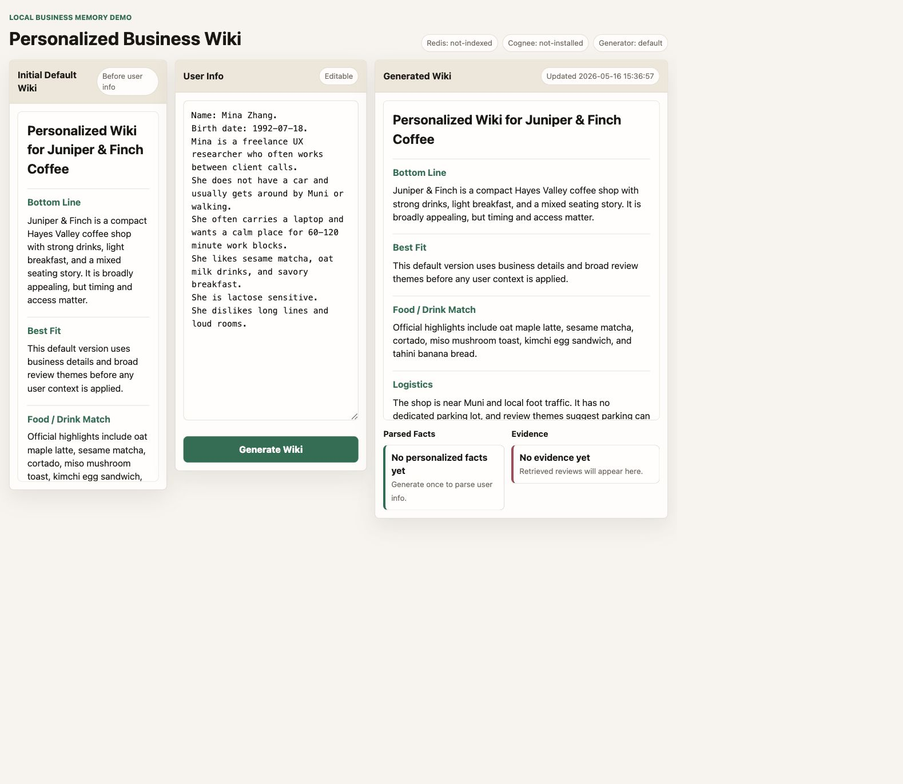
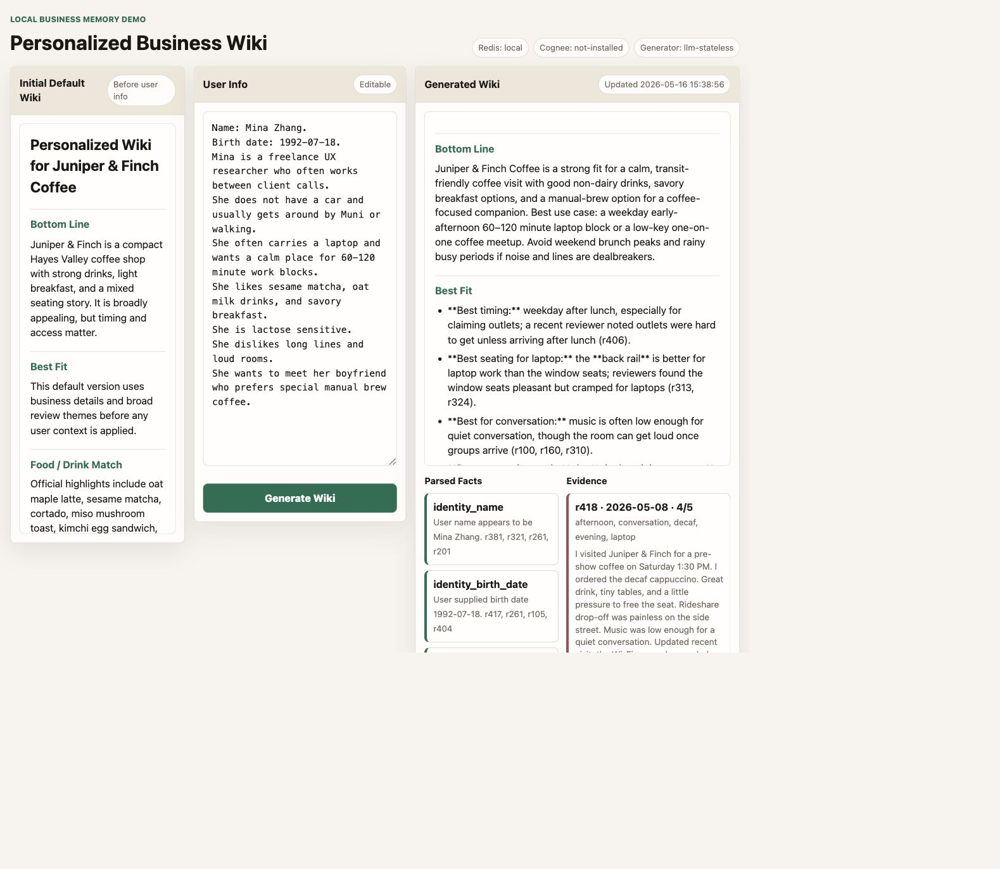
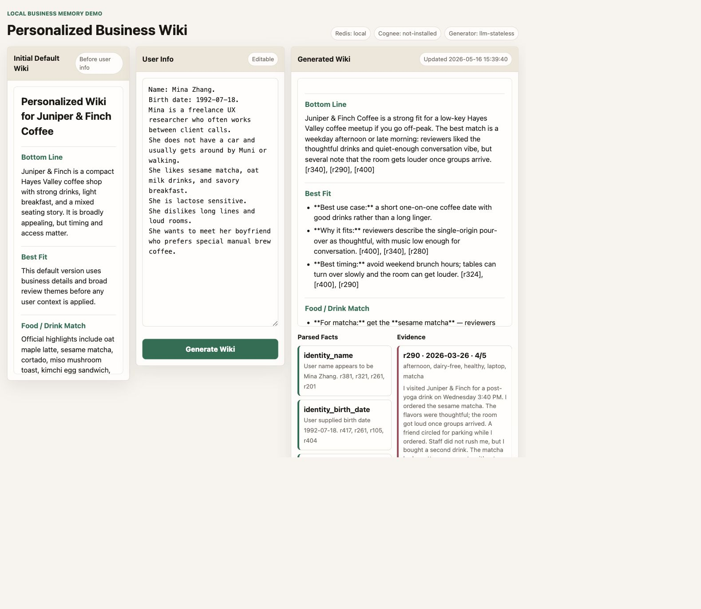
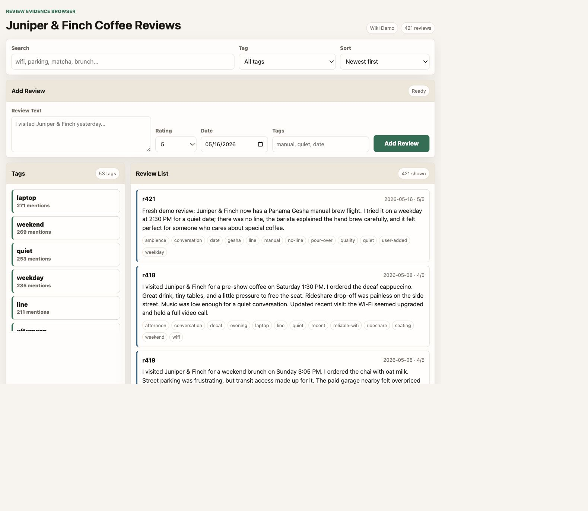
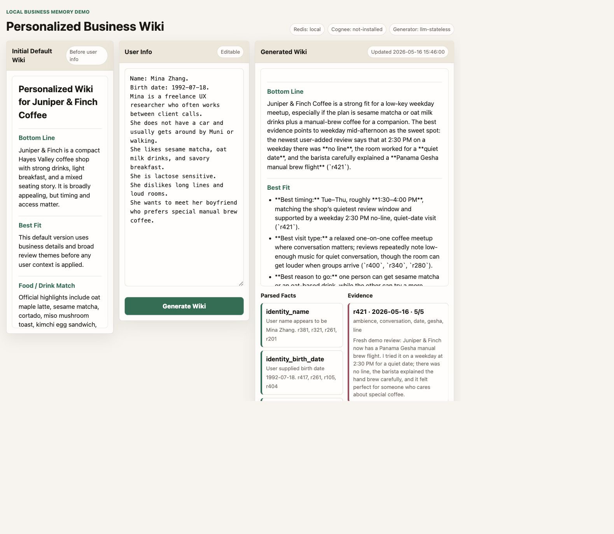
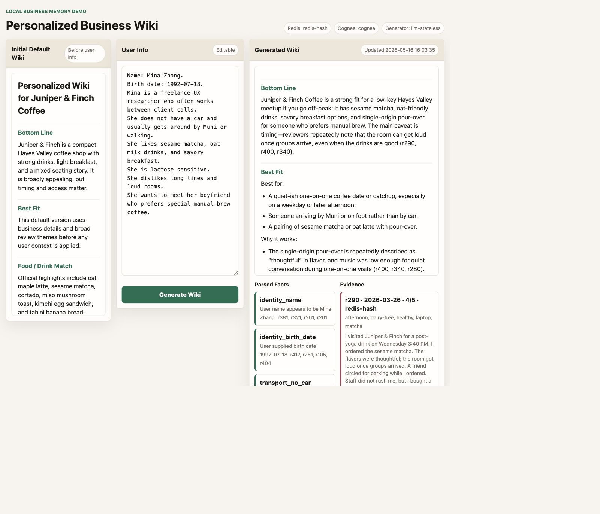
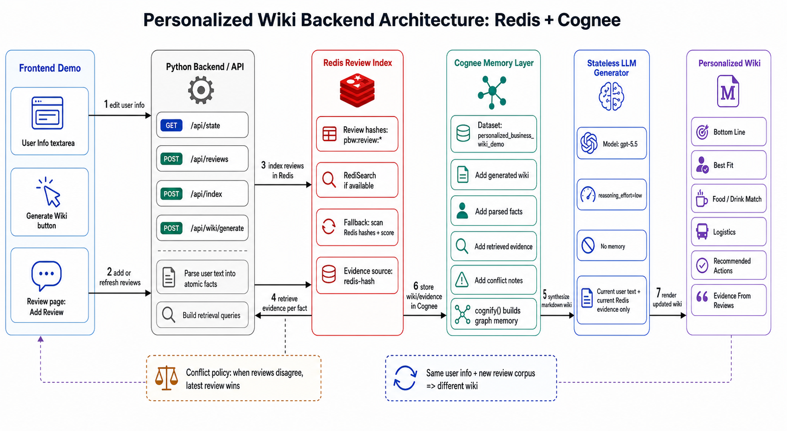

# Personalized Wiki for Juniper & Finch Coffee

Hackathon project for the Cognee x Redis 2026-05-16 Agent LLM Wiki challenge.

This demo turns a small business review corpus into a personalized, evidence-backed wiki. A user edits one `User Info` text box, clicks `Generate Wiki`, and the backend parses the current text into facts, retrieves relevant review evidence, stores the hot generation turn in Redis session memory, distills the result into Cognee, and asks a stateless LLM to write a fresh wiki.

## Why It Fits The Challenge

- **Ingest:** synthetic cafe reviews, user turns, parsed facts, generated wiki text, review evidence, and conflict notes.
- **Query + self-improve:** each generation uses the current user text and current Redis-backed evidence. When the user adds or deletes facts, or adds a new review, the next query regenerates a different wiki from the updated evidence.
- **Lint:** conflict handling is explicit. When reviews disagree, the generator is instructed to prefer the newest relevant review and cite the evidence.
- **Redis session memory:** every generation writes a session bundle to `pbw:session:<session_id>` with user text, facts, evidence, conflicts, and wiki preview.
- **Cognee permanent memory:** that session bundle plus the generated wiki, facts, evidence, and conflict notes are added to the Cognee dataset `personalized_business_wiki_demo` and `cognify` runs in the background.

## Demo Proof

### 1. Default User Info -> personalized wiki



### 2. Add a new preference -> wiki changes

The user adds: "She wants to meet her boyfriend who prefers special manual brew coffee."



### 3. Delete a fact -> related wiki content disappears

The laptop / 60-120 minute work-block sentence is removed. The regenerated wiki stops recommending laptop work blocks, outlets, and weekday work sessions.



### 4. Add a new review -> same user info produces a new wiki

The review page lets the demo operator inject a fresh review. After adding a manual-brew/Gesha review, the same user profile regenerates a wiki that cites the new review evidence.





### 5. Stack status is visible in the UI

The running UI exposes Redis, Cognee, and stateless LLM status. In the verified run, Redis was connected in `redis-hash` mode, Cognee completed, and evidence cards showed Redis-backed retrieval.



## Architecture



```text
User Info textarea + Review page
        |
        v
Python API
  - parse current user text into atomic facts
  - retrieve review evidence for each fact
  - detect conflicts and prefer latest relevant reviews
        |
        +--> Redis review index
        |      pbw:review:* hashes
        |      RediSearch when available
        |      redis-hash scorer fallback
        |
        +--> Redis session memory
        |      pbw:session:<session_id>
        |      current user turn + facts + evidence + wiki preview
        |
        v
Cognee permanent memory
  - generated wiki
  - parsed facts
  - retrieved evidence
  - conflict/lint notes
        |
        v
Stateless LLM generator
  - current user text
  - current retrieved evidence
  - current business context
        |
        v
Personalized markdown wiki
```

## Run

```bash
python3 -m pip install --user -r requirements.txt
redis-server --daemonize yes
export REDIS_URL=redis://localhost:6379/0
export LLM_API_KEY="<event-or-your-own-key>"
export LLM_MODEL=gpt-5.5
export LLM_REASONING_EFFORT=low
python3 server.py
```

Open:

```text
http://127.0.0.1:8891
http://127.0.0.1:8891/review
```

## API

- `GET /api/state`
- `POST /api/index`
- `GET /api/reviews`
- `POST /api/reviews` with `{ "body": "...", "rating": 5, "reviewDate": "2026-05-16", "tags": "manual quiet date" }`
- `POST /api/wiki/generate` with `{ "userText": "..." }`

## Implementation Notes

Redis is first-class in the demo. Reviews are written to Redis hashes under `pbw:review:*`. RediSearch is used when present; otherwise retrieval scans Redis hashes and scores those Redis-backed review records locally. Each generation also writes the current working turn to `pbw:session:<session_id>`, which is the hot session-memory layer the challenge asks for.

Cognee is wired into the generation flow. If `cognee` is installed and `LLM_API_KEY` or `OPENAI_API_KEY` is set, the server adds the Redis session reference, generated wiki, parsed fact set, review evidence bundle, and conflict-resolution note to the Cognee dataset `personalized_business_wiki_demo`, then runs `cognify`. By default this runs in the background so the UI does not wait on the knowledge-graph build.

Personalized LLM generation is stateless. The model receives only the current user text, current business context, current retrieved evidence, and current conflict notes. If no LLM key is set, the app shows an `LLM Required` status instead of silently using a rule-based personalized wiki.

## Test

```bash
python3 -m py_compile server.py test_demo.py
python3 -m unittest -v
```

Current validation: 14 unit tests passing, including Redis fallback, latest-review-wins conflict handling, added-review retrieval, add/delete user-info behavior, and "no rule-based personalized wiki without LLM key."
